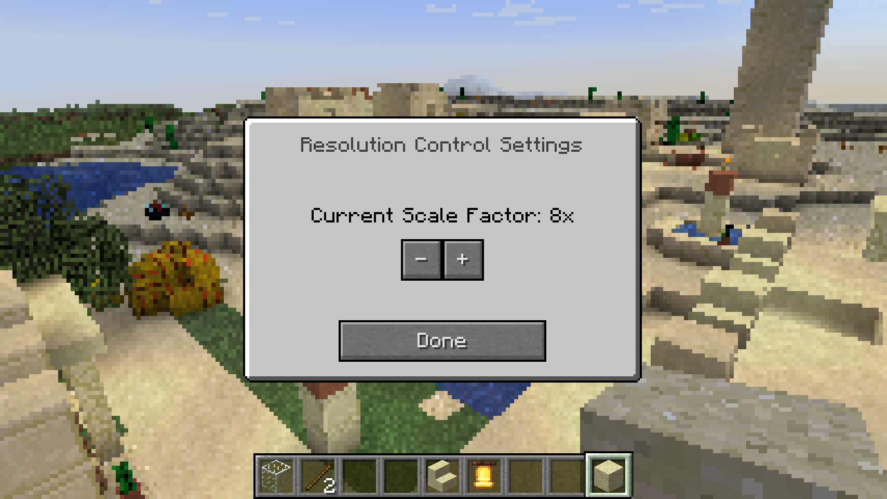

	

# Resolution Control

Resolution Control allows you to render Minecraft's 3D portion (i.e. the main game, but not the HUD/GUIs/etc.) at a lower resolution, using nearest-neighbor upsampling. It even has a snazzy settings screen (open by pressing `P` by default) allowing you to adjust this as you go.

Download in [the releases section](https://github.com/juliand665/Resolution-Control/releases) or on [CurseForge](https://www.curseforge.com/minecraft/mc-mods/resolution-control).

---

I created this mod mainly because Minecraft 1.13 made it render at full- rather than half-resolution on retina monitors, causing it to run really badly on my computer. Any way of downscaling I tried resulted in linear upsampling (rather than the nearest-neighbor upsampling Minecraft used to have), which looked blurry and terrible. Enter **Resolution Control**, the answer to your prayers!
